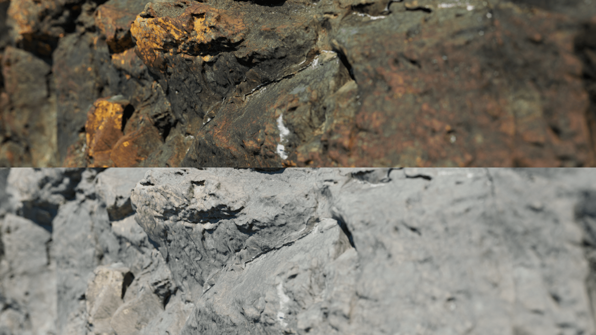
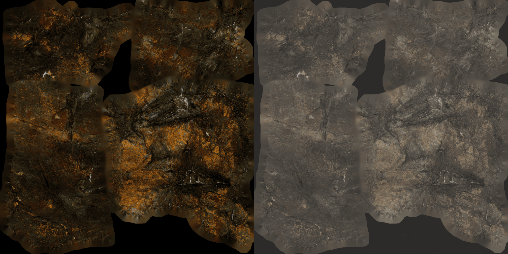
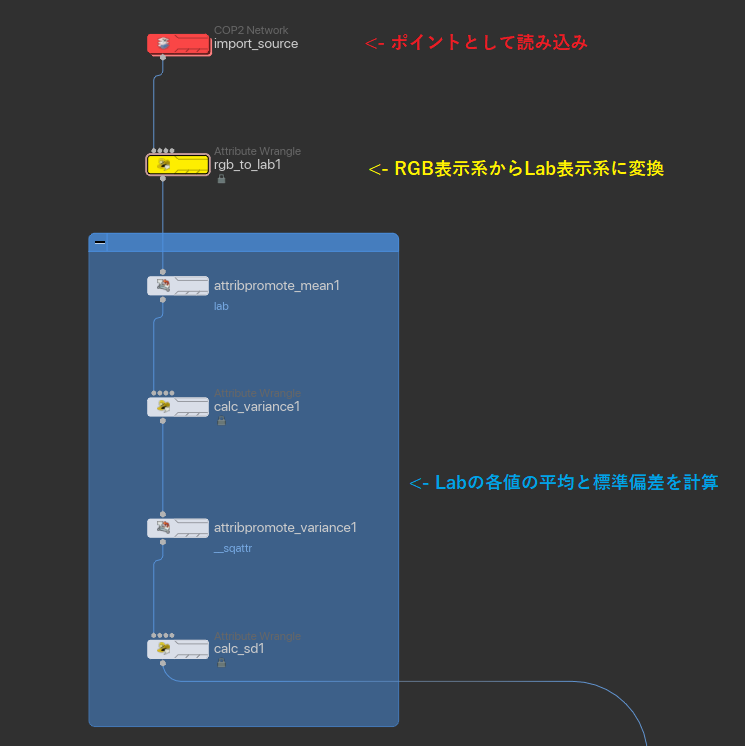
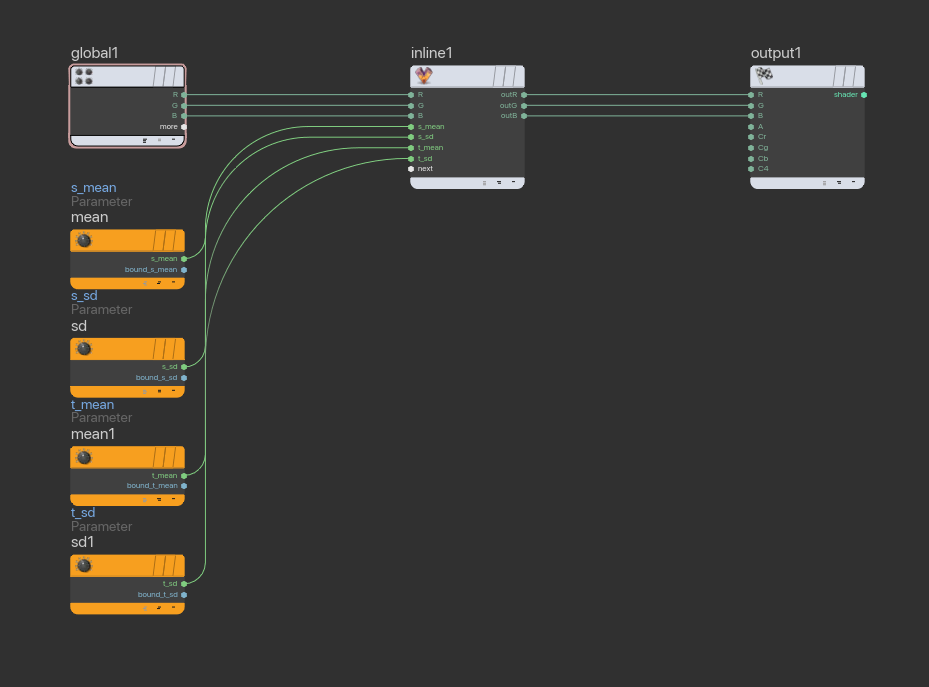

# Base Color Transformation

Megascansのライブラリには様々な地域でスキャンされたデータが存在します。それらを組み合わせて配置する際に、ベースカラーの色味を合わせて、ルックに統一性をもたせます。具体的には、古典的な画像の色変換の論文[Color Transfer between Images](https://www.cs.tau.ac.il/%7Eturkel/imagepapers/ColorTransfer.pdf)を用いて、スキャンされたアルベドテクスチャの色味を加工します。OpenCVやPyTorchなどのライブラリを使用した実装を参考に、HQueue上で管理しやすいようにすべてVEXで実装しました。

**sRGB→Labへの変換は特殊な行列演算を行うことでできるらですが、要調査**

## 注意
このアルゴリズムは多くの場合デティールを保持したまま色味を変えることができるが、例えば「青色の花」を「赤色の花」に変換するためには向いてない。あくまで元画像の色を指定画像の色に寄せるだけ、元画像の「青」を指定画像の「赤」に変換することは難しい。
また、ベースカラー等の陰影が除去された画像を陰影がついた画像に変換する場合は、コントラストが高くなってしまう場合がある。




## Houdiniにおける実装
### アルゴリズムについて

色を変更したい画像をA、色を抽出したい画像をBとすると、

以下の計算を各ピクセルごとに行う。

Input(sRGB) → Linear化 → xyz表示系に変換 → Lab表示系に変換 → Lab各値の平均と標準偏差を計算 → 式Aを適用 → xyz表示系に変換 → RGB表示系に変換

この内新しくHoudini内で実装しなければいけないのは

- xyz to lab
- 平均と標準偏差の計算
- color transformation
- lab to xyz
- 
[Wikipedia](https://en.wikipedia.org/wiki/CIELAB_color_space#CIELAB-CIEXYZ_conversions)の3項の式を参考にVEXで実装する。

```cpp
/// colortransformation.vfl
// XYZ -> Lab への変換
float forwardtransformation(float t)
{
    float delta = 6.0 / 29.0;
    float ft = t > pow(delta, 3) ? cbrt(t) : (t / ( 3 * delta * delta )) + 4.0 / 29.0;
    return ft;
}

vector xyz2lab(vector xyz)
{
    float xn = 95.0489 / 100;
    float yn = 100 / 100;
    float zn = 108.8840 / 100;
    float y = xyz.y / yn;
    float x = xyz.x / xn;
    float z = xyz.z / zn;

    float l = 116 * forwardtransformation(y) - 16;
    float a = 500 * (forwardtransformation(x) - forwardtransformation(y));
    float b = 200 * (forwardtransformation(y) - forwardtransformation(z));

    return set(l, a, b);
}

// Lab -> XYZ への変換
float reversetransformation(float t)
{
    float delta = 6.0 / 29.0;
    float rt = t > delta ? pow(t, 3) : 3 * delta * delta * ( t - (4.0/29.0) );
    return rt;
}

vector lab2xyz(vector lab)
{
    float xn = 95.0489 / 100;
    float yn = 100 / 100;
    float zn = 108.8840 / 100;

    float delta = 6.0 / 29.0;

    float y = (lab.x + 16) / 116;
    float x = y + (lab.y / 500);
    float z = y - (lab.z / 200);

    x = xn * reversetransformation(x);
    y = yn * reversetransformation(y);
    z = zn * reversetransformation(z);

    return set(x, y, z);
}

// Color Transformation Algorithm
float colortransformation(float x, s_mean, s_sd, t_mean, t_sd)
{
    x = ((x-s_mean)*(t_sd/s_sd)) + t_mean;
    return x;
}
```
### 平均と標準偏差の計算
COP内でループを回すと重そうなので、SOPで各ピクセルをポイントに、色をpointアトリビュートに変換して`Attribute Promote SOP`を使用し、平均と標準偏差を求める。各平均と標準偏差はCOPから参照できるようにdetailアトリビュートに保存する。
計算した平均と標準偏差をCOPで参照し、Inline VOPで作成した関数を使用する。

```cpp
// COP/Filter Vop/Inline Vop
# include <colortransformation.vfl>
vector rgb = set($R, $G, $B);
vector lab = xyz2lab(rgbtoxyz(rgb));

float newl = colortransformation(lab.x, $s_mean.x, $s_sd.x, $t_mean.x, $t_sd.x);
float newa = colortransformation(lab.y, $s_mean.y, $s_sd.y, $t_mean.y, $t_sd.y);
float newb = colortransformation(lab.z, $s_mean.z, $s_sd.z, $t_mean.z, $t_sd.z);

vector newcolor = xyztorgb(lab2xyz(set(newl, newa, newb)));

$outR = newcolor.r;
$outG = newcolor.g;
$outB = newcolor.b;

```




## 参考

[CIELAB color space](https://en.wikipedia.org/wiki/CIELAB_color_space#RGB_and_CMYK_conversions)
